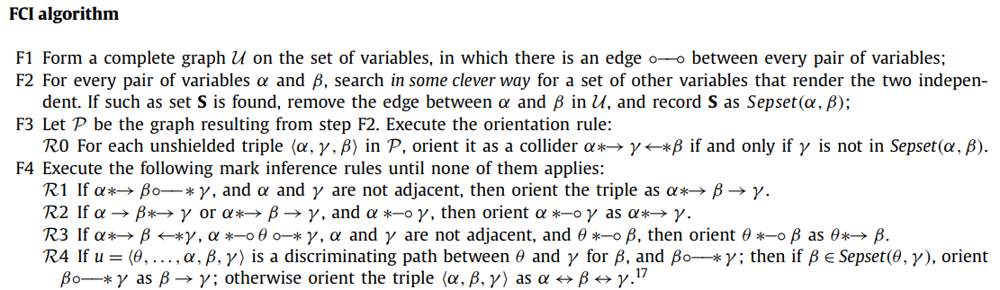

## Preliminaries

- R: SIAM workshop on R by Wenjie Wang
    + [session one](https://wenjie-stat.me/2018-01-19-siam/);
      [source repo](https://github.com/wenjie2wang/2018-01-19-siam/)
    + [session two](https://wenjie-stat.me/2018-04-06-siam/);
      [source repo](https://github.com/wenjie2wang/2018-04-06-siam/)

- Python
    + [Learning Python in one video](https://www.youtube.com/watch?v=N4mEzFDjqtA)

- Bookdown by Yihui Xie
    + [R package source](https://github.com/rstudio/bookdown)
    + [online book](https://bookdown.org/yihui/bookdown/)

- Git/GitHub
    + [Learn Git in 20 minues](https://www.youtube.com/watch?v=Y9XZQO1n_7c)

## R Packages {.maxHeight600 }

```{r setup, include=FALSE, echo = FALSE}
options(width = 90)

## decrease font size in code chunks for beamer
if (knitr::is_latex_output()) {
    ## https://stackoverflow.com/questions/
    ## 25646333/code-chunk-font-size-in-rmarkdown-with-knitr-and-latex
    knitr::opts_chunk$set(size = "chunksize")
    def.chunk.hook  <- knitr::knit_hooks$get("chunk")
    knitr::knit_hooks$set(chunk = function(x, options) {
        paste0("\\bigskip\\", options$size, "\n", x, "\n", "\\normalsize")
    })
}
```

```{r need-packages}
##' Load needed packages, and install them if not installed.
##'
##' @usage need.packages(pkg)
##' @param pkg A character vector specifying the packages needed to
##'     reproduce this document.
##' @param ... Other arguments passed to function
##'     \code{\link[base]require}.
##' @return \code{NULL} invisibly.
##' @examples
##' need.pacakges(c("ggplot2", "geepack"))
need.packages <- function(pkg, ...)
{
    new.pkg <- pkg[! (pkg %in% installed.packages()[, "Package"])]
    if (length(new.pkg))
        install.packages(new.pkg, repos = "https://cloud.r-project.org")
    foo <- function(a, ...) suppressMessages(require(a, ...))
    sapply(pkg, foo, character.only = TRUE)
    invisible(NULL)
}
pkgs <- c("bookdown", "revealjs")
need.packages(pkgs)
```


```{r include = FALSE, echo = FALSE}
## automatically create a bib database for R packages
knitr::write_bib(c(
  # .packages(),
  pkgs
  ), 'packages.bib')
```


## Motivation

- Hands on realworld data analytics

- Tools for analytics as well as tools for project management

- Workflow ensuring reproducibility

- Version control

- Learning on the fly

- Communications (oral, written, critical review, etc.)

- Data science competitions / data challenges

## Operation

- Instructor is a coach

- Everyone is both an instructor, a learner, and a reviewer

- Projects (training/real; group/individual; common/open; repository)

- Peer review like a journal review system

- Open source book on data science in action

- Guest lecturers

- Outreach (partnership with CT Open Data, CT Data Collaborative, etc.)

- Google

## Topics

- Clusterd data analysis (GEE, copulas, NLME)

- Causal inference

- Deep learning

- Propensity score

#  Preliminaries: Statistical and Causal Models

## Simpson's Paradox

- Edward Simpson (1951, JRSSb)

- A statistical association that holds for an entire population is reversed in every subpopulation.

- Table 1.1 Results of a study into a new drug, with gender being taken into account

- The reason the drug appears to be harmful overall is that, if we select a drug user at random, that person is more likely to be a woman and hence less likely to recover than a random person who does not take the drug.

- Put differently, being a woman is a common cause of both drug taking and failure to recover.

## Simpson's Paradox: Continuous varaible

- Figure 1.1 Results of the exercise–cholesterol study, segregated by age

- However, segregated data does not always give the correct answer.

- Suppose we looked at the same numbers from our first example of drug taking and recovery, instead of recording participants’ gender, patients’ blood pressure were
recorded at the end of the experiment.

    - the drug affects recovery by lowering the blood pressure of those who take it—but unfortunately, it also has a toxic effect.
    - would you recommend the drug to a patient?


## Segregated data does not always give the correct answer

- Table 1.2 Results of a study into a new drug, with posttreatment blood pressure taken into account

- Since lowering blood pressure is one of the mechanisms by which treatment affects recovery, it makes no sense to separate the results based on blood pressure.

- So we consult the results for the general population, we find that treatment increases the probability of recovery, and we decide that we should recommend treatment.

- None of the information that allowed us to make a treatment decision—not the timing of the measurements, not the fact that treatment affects blood pressure, and not the fact that blood pressure affects recovery—was found in the data.

- Trivial though the assumption “treatment does not cause sex” may seem, there is no way to test it in the data, nor is there any way to represent it in the mathematics of standard statistics.

## A calculus of causation

In order to rigorously approach our understanding of the causal story behind data, we need four things:

1. A working definition of “causation.”
2. A method by which to formally articulate causal assumptions—that is, to create causal
models.
3. A method by which to link the structure of a causal model to features of data.
4. A method by which to draw conclusions from the combination of causal assumptions
embedded in a model and data.

A variable $X$ is a cause of a variable $Y$ if $Y$ in any way relies on X for its value.

## Graph

- Graph theory provides a useful mathematical language that allows us to address problems of causality with simple operations similar to those used to solve arithmetic problems.

- A mathematical graph is a collection of _vertices_ (or, as we will call them, _nodes_) and _edges_.

- Two nodes are _adjacent_ if there is an edge between them.
- _complete graph_
- _path_ between two nodes
- directed vs undirected
- parent vs child
- ancester vs descendant
- cyclic vs acyclic

## Structural causal model

- A structural causal model consists of two sets of variables $U$ and $V$, and a set of functions $f$ that assigns each variable in $V$ a value based on the values of the other variables in the model.

- A variable $X$ is a direct cause of a variable $Y$ if $X$ appears in the function that assigns $Y$’s value. $X$ is a cause of $Y$ if it is a direct cause of $Y$,or of any cause of $Y$.

- exogenous vs endogenous

- root node

- Every SCM is associated with a graphical causal model, referred to informally as a “graph- ical model” or simply “graph.”

- We will deal primarily with SCMs for which the graphical models are directed acyclic graphs (DAGs).

## Product decomposition

- Rule of product decomposition:
For any model whose graph is acyclic, the joint distribution of the variables in the model is given by the product of the conditional distributions $P(child \mid parents)$ over all the “families” in the graph. Formally, we write this rule as
\[
P(x_1, x_2, \ldots , x_n) = \prod_i P(x_i | pa_i)
\]
where $pa_i$ stands for the values of the parents of variable $X_i$.

# Graphical Models and Their Applications

## Connecting Models to Data

- Probabilities, graphs, structural equations

- The concept of independence, which in the language of probability is defined by alge
braic equalities, can be expressed visually using directed acyclic graphs (DAGs).

- Further, this graphical representation will allow us to capture the probabilistic information that is embedded in a structural equation model.

- Shoule be able to predict patterns of independencies in the data, based solely on the structure of the model’s graph, without relying on any quantitative information carried by the equations or by the distributions of the errors

## Chains

- Figure 2.1

    1. $Z$ and $Y$ are dependent
    2. $Y$ and $X$ are dependent
    3. $Z$ and $X$ are likely dependent
    4. $Z$ and $X$ are independent, conditional on $Y$

- SCM 2.2.4 Pathological Case of Intransitive Dependence

- This configuration of variables --- three nodes and two edges, with one edge directed into and one edge directed out of the middle variable --- is called a _chain_.

- __Rule 1 (Conditional Independence in Chains)__ Two variables, $X$ and $Y$, are conditionally independent given $Z$, if there is only one unidirectional path between $X$ and $Y$ and $Z$ is any set of variables that intercepts that path.

## Forks

- Figure 2.2

    1. $X$ and $Y$ are dependent
    2. $X$ and $Z$ are dependent
    3. $Z$ and $Y$ are likely dependent
    4. $Y$ and $Z$ are independent, conditional on $Y$

- Why are $Y$ and $Z$ independent conditional on X?

- This configuration of variables --- three nodes, with two arrows emanating from the middle variable --- is called a _fork_.

- __Rule2 (Conditional Independence in Forks)__ If a variable $X$ is a common cause of variables $Y$ and $Z$, and there is only one path between $Y$ and $Z$, then $Y$ and $Z$ are independent conditional on $X$

## Colliders

- Figure 2.3

    1. $X$ and $Z$ are dependent
    2. $Y$ and $Z$ are dependent
    3. $X$ and $Y$ are independent
    4. $X$ and $Y$ are dependent conditional on $Z$

- A _collider_ node occurs when one node receives edges from two other nodes.

- Why does point 4 hold? Conditioning on a collision node produces a dependence between the node’s parents

- Monty Hall problem

- __Rule 3 (Conditional Independence in Colliders)__ If a variable $Z$ is the collision node between two variables $X$ and $Y$, and there is only one path between $X$ and $Y$, then $X$ and $Y$ are unconditionally independent but are dependent conditional on $Z$ and any descendants of $Z$

## $d$-separation

- Is there a criterion or process that can be applied to a graphical causal model of any complexity in order to predict dependencies that are shared by all data sets generated by that graph?

- A pair of nodes are $d$-connected if there exists a connecting path between them, or $d$-separated, if there exists no such path.

- When we say that a pair of nodes are $d$-separated, we mean that the variables they represent are definitely independent; when we say that a pair of nodes are $d$-connected, we mean that they are possibly, or most likely, dependent.

- Two nodes are $d$-separated if every path between them (should any exist) is blocked.

- The paths between variables can be thought of as pipes, and dependence as the water that flows through them; if even one pipe is unblocked, some water can pass from one place to another, and if a single path is clear, the variables at either end will be dependent. However, a pipe need only be blocked in one place to stop the flow of water through it, and similarly, it takes only one node to block the passage of dependence in an entire path.

## Nodes that can block a path

- If we are not conditioning on any variable, then only colliders can block a path.

- If, however, we are conditioning on a set of nodes $Z$, then the following kinds of nodes can block a path:
    + A collider that is not conditioned on (i.e., not in $Z$), and that has no descendants in $Z$
    + A chain or fork whose middle node is in $Z$.

- Definition 2.4.1 ($d$-separation)

- Example, Figure 2.7

## Model testing

- $d$-separation will tell us which variables in $G$ must be independent conditional on which other variables. Conditional independence is something we can test for using a data set.

- Example, Figure 2.9
    + Not only we know that the model is wrong, but we also know where it is wrong; the true model must have a path between $W$ and $Z_1$ that is not $d$-separated by $X$
    + Finally, this is a theoretical result that holds for all acyclic models with independent errors (Verma and Pearl 1990), and we also know that if every d-separation condition in the model matches a conditional independence in the data, then no further test can refute the model. This means that, for any data set whatsoever, one can always find a set of functions F for the model and an assignment of probabilities to the U terms, so as to generate the data precisely.

## Causal search

- $d$-separation presents several advantages over the global testing method
    + nonparametric
    + local test

- could test and reject many possible models in this way, even- tually whittling down the set of possible models to only a few whose testable implications do not contradict the dependencies present in the data set.

- some graphs have indistinguishable implication

- allows us to search a data set for the causal models that could have generated it.


# The Effects of Interventions

## Intervention

- Predict effects of interventions.

- Correlation is not causation.

- Randomized controlled experiment can solve this problem. But we can't control some factors. Then only observationsl study can be conducted, which is hard to untangle causal from merely correlative.

- Intervene and condition are different. Intervene changes the model structure, but condition doesn't. (Figure 3.2)

- $do$-expression and graph surgery can help solve this problem.

## The Adjustment Formula

- Causal effect; adjusting for Z or controlling for Z.

- Example: Simpson's paradox, Figure 3.3, 3.4.

### To Adjust or not?

- __Rule 1 (The Causal Effect Rule)__ Given a graph G in which a set of variables PA are designated as the parents of X, the causal effect of X on Y is given by
\[
P(Y = y|do(X = x)) = \sum_z P(Y = y|X = x, PA = z)P(PA = z)
\]
where z ranges over all the combinations of values that the variables in PA can take. If we multiply and divide the right hand side by the probability $P(X = x|PA = z)$, we get a more convenient form:
\[
P(y|do(x)) = \sum_z \frac{P(X = x, Y = y, PA = z)}{P(X = x|PA = z)}
\]

- It is possible to use graphs and underlying assumptions, we are able to identify causal relationships in purely obervational data.

- In most practical cases, the set of X’s parents (PA(X)) will contain unobserved variables that would prevent us from calculating the conditional probabilities in the adjustment formula. Solution: adjust other variables to substitute for the unmeasured elements of PA(X).

### Multiple Interventions and the Truncated Product Rule

- _Truncated product formula_ or _g-formula_:
\[
P(x_1, x_2, \dots, x_n|do(x)) = \prod_i P(x_i|pa_i)
\]
for all $X_1, X_2, \dots, X_n$ not in $X$.

- \[ P(x_1, x_2, \dots, x_n|do(x)) = \frac{P(x_1, x_2, \dots, x_n, x)}{P(x|pa)}
\]


## The Backdoor Criterion

- Under what conditions, is the structure of the causal graph sufficient for computing a causal effect from a given data set? The rest of this chapter will focuse on this problem.

- __The Backdoor Criterion__ Given an ordered pair of variables (X,Y) in a directed acyclic graph G, a set of variables Z satisfies the backdoor criterion relative to (X, Y) if no node in Z is a descendant of X, and Z blocks every path between X and Y that contains an arrow into X. (when conditioned on Z)

- If a set of variables Z satisfies the backdoor criterion for X and Y, then the causal effect of X on Y is given by the formula:
\[
P(Y = y|do(X = x)) = \sum_z P(Y = y|X = x, Z = z)P(Z = z)
\]
just as when we adjust for PA(X). (Note that PA(X) always satisfies the backdoor criterion.)
Example Figure 3.3

- In general, we would like to condition on a set of nodes Z such that

  1. We block all spurious paths between X and Y.
  2. We leave all directed paths from X to Y unperturbed.
  3. We create no new spurious paths.

- _Effect modification_ or _moderation_. Find the causal effect when we condition on some variable. Example, Figure 2.8; 3.6.

## The Front-Door Criterion (Example, Smoking and Lung Cancer)

- __Front-Door__ A set of variables Z is said to satisfy the front-door criterion relative to an ordered pair of variables (X, Y) if

  1. Z intercepts all directed paths from X to Y.
  2. There is no unblocked path from X to Z.
  3. All backdoor paths from Z to Y are blocked by X.

- __Front-Door Adjustment__ If Z satisfies the front-door criterion relative to (X, Y) and if $P(x, z) > 0$, then the causal effect of X on Y is identifiable and is given by the formula:
\[
P(y|do(x)) = \sum_z P(z|x) \sum_{x'} P(y|x', z)P(x')
\]

## Conditional Interventions and Covariate-Specific Effects

- Interventions may involve dynamic policies in which a variable X is made to respond in a specified way to some set Z of other variables—say, through a functional relationship $x = g(z)$ or through a stochastic relationship, whereby X is set to x with probability $P^*(x|z)$.

- The result of implementing such a policy is a probability distribution written $P(Y = y|do(X = g(Z)))$, which depends only on the function $g$ and the set $Z$ of variables that drive $X$.

- __Rule 2__ The z-specific effect $P(Y = y|do(X = x), Z = z)$ is identified whenever we can measure a set S of variables such that $S \cup Z$ satisfies the backdoor criterion. Moreover, the z-specific effect is given by the following adjustment formula:
\[
P(Y = y|do(X = x), Z = z) = \sum_s P(Y = y|X = x, S = s, Z = z)P(S = s|Z = z)
\]

- To compute $P(Y = y|do(X = g(Z)))$, we condition on $Z = z$ and write:
\begin{equation*}
\begin{split}
P(Y = y|do(X = g(Z))) &= \sum_z P(Y = y|do(X = g(Z)), Z = z)P(Z = z|do(X = g(Z)))\\
                      &= \sum_z P(Y = y|do(X = g(z)), Z = z)P(Z = z)\\
                      &= \sum_z P(Y = y|do(X = x),z)|_{x=g(z)}P(Z = z)
\end{split}
\end{equation*}

## Inverse Probability Weighing

- Practical difficulties: adjusting for Z but Z contains too many variables.

- Assuming that the function $P(X = x|Z = z)$ is available to us, we can use it to generate artificial samples that act as though they were drawn from the postintervention probability $P_m$, rather than $P(x, y, z)$.

- \begin{equation*}
\begin{split}
P(y|do(x)) &= \sum_z P(Y = y|X = x, Z = z)P(Z = z)\\
           &= \sum_z \frac{P(Y = y|X = x, Z = z)P(X = x|Z = z)P(Z = z)}{P(X = x|Z = z)}\\
           &= \sum_z \frac{P(X = x, Y = y, Z = z)}{P(X = x|Z = z)}
\end{split}
\end{equation*}

## Mediation

- Causation: direct and indirect (through mediating variables).

- Seperate direct and indirect effects: condition on mediating variables. Example, Figure 3.11, 3.12

- Intervene. For any three variables $X$, $Y$, and $Z$, where $Z$ is a mediator between $X$ and $Y$, _Controlled direct effect_ (CDE) on $Y$ of changing the value of $X$ from $x$ to $x'$ is defined as:
\[
CDE = P(Y = y|do(X = x), do(Z = z)) - P(Y = y|do(X = x'), do(Z = z))
\]
Example Figure 3.12.

- In general, the CDE of $X$ on $Y$, mediated by $Z$, is identifiable if the following two properties hold:
  1. There exists a set $S_1$ of variables that blocks all backdoor paths from $Z$ to $Y$.
  2. There exists a set $S_2$ of variables that blocks all backdoor paths from X to Y, after
  deleting all arrows entering Z (intervene on Z).


## Causal Inference in Linear Systems

- Assumptions used in this section:
  1. the relationships between variables are linear.
  2. all error terms have Gaussian (or “normal”) distributions.

### Structural versus Regression Coefficients

- A regression equation is descriptive; it makes no assumptions about causation.

- We use Greek letter ($\alpha$, $\beta$ and so on) for structural coefficients and $r_i$ for regression coefficients. $U_1$ for error term in structural equations and $\epsilon_i$ for those in regression equations.

### The Causal Interpretation of Structural Coefficients

- In a linear system, every path coefficient stands for the direct effect of the independent variable, $X$, on the dependent variable, $Y$.

- In a linear system, the total effect of $X$ on $Y$ is simply the sum of the products of the coefficients of the edges on every nonbackdoor path from $X$ to $Y$. Example, Figure 3.13.

### Identifying Structural Coefficients and Causal Effect

- Total effect: First, we find a set of covariates $Z$ that satisfies the backdoor criterion from $X$ to $Y$ in the model. Then, we regress $Y$ on $X$ and $Z$. The coefficient of $X$ in the resulting equation represents the true causal effect of $X$ on $Y$. Example, Figure 3.14.

- Direct effect: In a linear system, this direct effect is the structural coefficient $\alpha$ in the function $y = \alpha x + \beta z + \cdots + U_Y$ that defines $Y$ in the system.

- Direct effect (from data):
  1. First, we remove the edge from $X$ to $Y$ (if such an edge exists), and call the resulting
  graph $G_\alpha$. If, in $G_\alpha$, there is a set of variables $Z$ that d-separates $X$ and
  $Y$, then we can simply regress $Y$ on $X$ and $Z$. The coefficient of $X$ in the resulting
  equation will equal the structural coefficient $\alpha$. Example, Figure 3.15, 3.16.

  2. If there is no set of variables that $d$-separates $X$ and $Y$ in $G_\alpha$, we can use total effects to identify direct effects. _Instrumental variable_: it is $d$-separated from $Y$ in $G_\alpha$ and, it is $d$-connected to $X$. Example, Figure 3.17.

- To estimate a given effect, all we need to do is to write down a regression equation and specify:
  1. what variables should be included in the equation and
  2. which of the coefficients in that equation represents the effect of interest.

# Counterfactuals and Their Applications

## Counterfactuals
- While driving home last night, I came to a fork in the road, where I had to make a choice: to take the freeway ($X$ = 1) or go on a surface street named Sepulveda Boulevard ($X$ = 0). I took Sepulveda, only to find out that the traffic was touch and go. As I arrived home, an hour later, I said to myself: "Gee, I should have taken the freeway."

- This kind of statement, an "if" statement in which the "if" portion is untrue or unrealized is known as a counterfactual

- The "if" portion of a counterfactual is called the hypothetical condition, or more often, the antecedent

- We use counterfactuals to emphasize our wish to compare two outcomes under the exact same conditions while differing only in one aspect: the antecedent.

- Writing $\mathbb{E}[\text{driving time}|do(\text{freeway}), \text{driving time}=1 \text{ hour}]$ leads to a clash between the driving time we wish to estimate and actual driving time observed.

-To avoid clash, distinguish symbolically between:

    1. Actual driving time
    2. Hypothetical driving time under freeway conditions when actual surface driving time is known to be 1 hour

- To do so, use different subscripts to label two outcomes

    - denote freeway driving time by $Y_{X = 1}$ (or $Y_1$)
    - denote Sepulveda driving time by $Y_{X = 0}$ (or $Y_0$)


- Since $Y_0$ is the $Y$ actually observed, we wish to estimate $\mathbb{E}[Y_{X=1}| X = 0, Y = Y_0 = 1]$.

## Defining and Computing Counterfactuals

### The Structural Interpretation of Counterfactuals
- Begin with fully specified model $M$, for which functions $\{F\}$ and values of exogenous variables are all known.

- Simple causal model consisting of three variables: X, Y, U defined by:

    1. $X = aU$
    2. $Y = bX + U$

- Computing the counterfactual $Y_x(u)$, that is what $Y$ would be had $X$ been $x$ in situation $U = u$

- Replacing first equation with $X = x$ gives "modified" model $M_x$:

    1. $X = x$
    2. $Y = bX + U$

- Substituting $U = u$, and solving gives $Y_x(u) = bx + u$

- We can also examine counterfactual $X_y(u)$, that is, what $X$ would be had $Y$ been $y$ in situation $U = u$.
  - Replacing second equation by constant $Y = y$ and solving for $X$, we have $X_y(u) = au$, which means $X$ remains unaltered by the hpothetical condition "had $Y$ been $y$"

- Each SCM encodes within it many counterfactuals corresponding to various values its variables can take.

- $\textbf{Note}$: We compute not just the probability of expected value of $Y$ under one intervention or another, but the $\textbf{actual value of Y}$ under the hypothesized $\textit{new}$ condition $X = x$. Every structural equation model assigns a definitive value to every conceivable counterfactual.

### The Fundamental Law of Counterfactuals
- Consider any arbitrary two variables $X$ and $Y$, not necessarily connected by a single equation. Let $M_x$ stand for the modified version of $M$, with the equation of $X$ replaced by $X = x$. The formal definition of the counterfactual $Y_x(u)$ reads: \begin{equation}\label{eq:cf1}
Y_x(u) = Y_{M_x}(u)
\end{equation}

- In words: The countervactual $Y_x(u)$ in model $M$ is defined as the solution for $Y$ in the 'surgically modified' submodel $M_x$.

- Eq.(\ref{eq:cf1}) is a fundamental principle of causal inference allowing us to answer questions of the type "what would $Y$ be had $X$ been $x$?"

- Counterfactuals obey the $\textbf{consistency rule}$: _if_ $X = x$ _then_ $Y_x = Y$

    - For example, if $X$ is binary, then consistency rule takes form $Y = XY_1 + (1 - X)Y_0$. This can be interpretted as $Y_1$ is equal to the observed value of $Y$ whenever $X$ takes the value 1.

### From Population Data to Individual Behavior: An Illustration
- Fig. 4.1 represents an 'encouragement design' (p.94)

    - $X$ is amount of time a student spends in an after-school remedial program
    - $H$ is the amount of homework a student does
    - $Y$ is a student's score on exam
    - Value of each variable is given as number of standard deviations above the mean the student falls

- Model 4.1:
\begin{equation*}
\begin{split}
  X &= U_X \\
  H &= aX + U_H \\
  Y &= bX + cH + U_Y \\
  \sigma_{U_i U_j} &=0 \quad \forall i,j \in \{X, H, Y\}
\end{split}
\end{equation*}

- Assume all $U$ factors are independent, and we are given the values of coefficients: $$a = 0.5, \quad b = 0.7, \quad c = 0.4$$

- Consider Joe for whom we measure: $$X = 0.5, \quad H = 1, \quad Y = 1.5$$

- We ask the question: 'What would Joe's score have been had he doubled his study time?'

    - Use evidence $X = 0.5, \quad H = 1, \quad Y = 1.5$ to determine the values of the $U$ variables associated with Joe
    - These values are invariant to hypothetical actions

- Obtaining the specific characteristics of Joe from evidence:
\begin{equation*}
\begin{split}
  U_X &= 0.5 \\
  U_H &= 1 - 0.5 \cdot 0.5 = 0.75 \\
  U_Y &= 1.5 - 0.7 \cdot 0.5 - 0.4 \cdot 1 = 0.75
\end{split}
\end{equation*}

- Simulating the action of doubling Joe's study time by replacing the structural equation for $H$ with the constant $H = 2$ gives modified model in Fig. 4.2. (p.95). Compute the value of $Y$ in modified model using updated $U$ values.
\begin{equation*}
\begin{split}
  Y_{H=2}(U_X &= 0.5, U_H = 0.75, U_Y = 0.75) \\
  &= 0.5 \cdot 0.7 + 2.0 \cdot 0.4 + 0.75 \\
  &= 1.90
\end{split}
\end{equation*}

    - Had Joe doubled his homework, his score would have been 1.9 instead of 1.5

- In summary we applied evidence to update the values of the $U$ variables, simulate external intervention to foce condition by replacing structural equation with constant, then  compute value of $Y$ given new structural equations and the updated $U$ values.

### The Three Steps in Computing Counterfactuals

- The three-step process for computing any deterministic counterfactual:

    1. Abduction: Use evidence $E = e$ to determine the value of $U$
    2. Action: Modify the model, $M$, by removing the structural equations for the variables in $X$ and replacing them with the appropriate functions $X = x$, to obtain the modified model, $M_x$
    3. Prediction: Use the modified model, $M_x$, and the value of $U$ to compute the value of $Y$, the consequence of the counterfactual

- The above process will solve any deterministic counterfactual, that is, counterfactuals pertaining to a single unit of the population in which we know the value of every relevant variable.

- Counterfactuals can also be probabilistic, that is pertaining to a class of units within the population.

    - A typical query might be: 'Given that we observe feature $E = e$ for a given individual, what would we expect the value of $Y$ for that individual to be if $X$ had been $x$?'
    - This expectation is denoted $\mathbb{E}[Y_{X = x}|E = e]$, where $E = e$ is allowed to conflict with the antecedent $X = x$
    - We can generalize the three-step process to any probabilistic nonlinear system.

- Given an arbitrary counterfactuals of the form $\mathbb{E}[Y_{X = x} | E = e]$, the three-step process reads:

    1. Abduction: Update $P(U)$ by the evidence to obtain $P(U|E = e)$
    2. Action: Modify the model, M, by removing the structural equations for the variables in $X$ and replace them with the appropriate functions $X = x$ to obtain the modified model $M_x$
    3. Use the modified model, $M_x$, and the updated probabilities over the $U$ variables, $P(U|E = e)$, to compute the expectation of $Y$, the consequence of the counterfactual

## Nondeterministic Counterfactuals

### Probabilities of Counterfactuals

- Refer to Eqs. (4.3) and (4.4) on p. 92

- Imagine that $U = \{1, 2, 3\}$ represents three types of individuals in a population, occurring with probabilities $$P(U = 1) = \frac{1}{2}, \quad P(U = 2) = \frac{1}{3}, \quad P(U = 3) = \frac{1}{6}$$

- All individuals within a population type have the same values of the counterfactuals as specified by the rows in Table 4.1 (p.93). Using these values, it is possible to compute the probability that the counterfactual will satisfy a specific condition.

- For example: We can compute the proportion of units for which $Y$ would be 3 had $X$ been 2, or using notation $Y_2(u) = 3$.

    - Refer to table to see that $P(Y_2 = 3) = \frac{1}{2}$
    - Using the table, how about $P(Y_2 > 3)$? $\quad \quad \quad \quad \quad$ (Answer: $\frac{1}{2}$)

- We can also compute joint probabilities of every combination of counterfactual and observable events:

    - For example: $P(Y_2 > 3, Y_1 < 4) = \frac{1}{3}$
    - This is the joint probability of two events occurring in two different 'worlds.' The firset $Y_2 > 3$ in an $X = 2$ world, and the second $Y_1 < 4$ in an $X = 1$ world.
    - These joint probabilities over 'multiple-world' counterfactuals are easily expressed using subscript notation, but _cannot_ be expressed using the _do(x)_ notation since the latter delivers a single probability for each intervention $X = x$.

- We can also compute conditional probabilities among counterfactuals:

    - For example: Among the individuals for which $Y$ is greater than 2, the probability is $\frac{2}{2}$ that $Y$ would increase if $X$ were 3 since $$P(Y_3 > Y | Y > 2) = \frac{\frac{1}{3}}{\frac{1}{2}} = \frac{2}{3}$$

- Example p.99

- Can counterfactual notation capture the postintervention single-world expression $\mathbb{E}[Y|do(X = x), Z = 1]$?

    - Answer: Yes
    - Translating $\mathbb{E}[Y|do(X = x), Z = 1]$ into counterfactual notation yields $\mathbb{E}[Y_{X=1}|Z_{X=1} = 1]$.
        - $Z_{X=1}$ stands for the value that $Z$ would attain had $X = 1$

- Example p. 100

### The Graphical Representation of Counterfactuals

- Can we see counterfactuals within the causal graphs associated with the model?

    - Yes!
    - From the fundamental law of counterfactuals, Eq.(\ref{eq:cf1}), if we modeify model $M$ to obtain the submodel $M_x$, then the outcome variable $Y$ in the modified model is the counterfactual $Y_x$ of the original model
    - This modification calls for removing all arrows entering the variable $X$

- $\textbf{Theorem 4.3.1: Counterfactual Interpretation of Backdoor}$: If a set $Z$ of variables satisfies the backdoor condition relative to $(X,Y)$, then, for all $x$, the counterfactual $Y_x$ is conditionally independent of $X$ given $Z$, $$P(Y_x|X,Z) = P(Y_x|Z)$$

    - Implies that $P(Y_x = y)$ is identifiable by adjustment formula of Eq. (3.5)
    \begin{equation*}
      \begin{split}
        PY_x = y) &= \sum\limits_z P(Y_x = y|Z = z)P(z) \\
                  &=  \sum\limits_z P(Y_x = y|Z = z, X = x) P(z) \\
                  &= \sum\limits_z P(Y = y|Z = z, X = x)P(z)
      \end{split}
    \end{equation*}

### Counterfactuals in Linear Models

- In nonparametric models, counterfactual quantities of the form $\mathbb{E}[Y_{X = x} | Z = z]$ may not be identifiable

- However, in fully linear models any counterfactual quanitity is identifiable whenever the model parameters are identified

- Question: Can counterfactuals be identified in observasional studies when some of the model parameters are not identified?

    - Yes!
    - Any counterfactual of the form $\mathbb{E}[Y_{X = x} | Z = e]$ where $e$ is an arbitrary set of evidence, is identified whenever $\mathbb{E}[Y|do(X = x)]$ is identified

- $\textbf{Theorem 4.3.2}$: Let $\tau$ be the slope of the total effect of $X$ on $Y$, $$\tau = \mathbb{E}[Y|do(x+1)] - \mathbb{E}[Y|do(x)]$$ then, for any evidence $Z = e$, we have $$\mathbb{E}[Y_{X = x}|Z = e] = \mathbb{E}[Y|Z = e] + \tau(x - \mathbb{E}[X|Z = e])$$

- Recall situation in Fig 4.2 (p. 95) where the counterfactual $Y_{H=2}$ under the evidence $e=\{X = 0.5, H = 1, Y = 1\}$ was computed. Theorem 4.3.2 can be applied to this model to comptue the _effect_ _of_ _treatment_ _on_ _the_ _treated_: $$ETT = \mathbb{E}[Y_1 - Y_0 | X = 1]$$ Substituting the evidence $e = \{X = 1\}$ into Theorem 4.3.2 (refer to model 4.1):
\begin{equation*}
  \begin{split}
    ETT &= \mathbb{E}[Y_1 | X = 1] - \mathbb{E}[Y_0|X = 1] \\
    &= \mathbb{E}[Y|X = 1] - E[Y|X = 1] + \tau(1 - \mathbb{E}[X|X=1]) - \tau(0 - \mathbb{E}[X|X=1]) \\
    &= \mathbb{E}[Y|do(x+1)] - \mathbb{E}[Y|do(x)] \\
    &= \tau \\
    &= b + ac \\
    &= 0.9
  \end{split}
\end{equation*}

## Practical Uses of Counterfactuals

### Recruitment to a Program

- Example 4.4.1 (p.107)

- Critics claim program is a waste of taxpayer's money and should be terminated, why?

    - Reasoning: While program was successful in experimental study, where people chosen at random, there is no proof the program is successful among those choosing to enroll of their own volition
    - Critis say those enrolling are more intelligent, resourceful and socially connected than those who are eligible and did not enroll
    - Critics claim that we need to estimate the _differential_ benefit of the program on those enrolled: the extent to which hiring rate has increasing among the enrolled, compared to what it would have been had they not been trained.

- Using counterfactual notation, letting $X = 1$ represent trianing, and $Y = 1$ represent hiring, we need to evaluate ETT (p.106 Eq. 4.18), that is $ETT = \mathbb{E}[Y_1 - Y_0|X = ]$

    - Unfortunately the difference $Y_1 - Y_0$ represents the causal effect of trianing $(X)$ on hiring $(Y)$ for a _randomly_ chosen individual, and the condition $X = 1$ limits the choice to those who actually chose the training on their own
    - This is a clash between the antecedent $(X = 0)$ of the counterfactual $Y_0$ and the event it is condition on $X = 1$
    - $\mathbb{E}[Y_0 | X = 1]$  can be reduced to estimable expressions in many situations (not all)

- When a set $Z$ of covariates satisfies the backdoor criterion with regard to the treatment and outcome variables, ETT probabilities are given by a modified adjustment formula:
\begin{equation}\label{eq:4.21}
P(Y_x = y| X = x') = \sum\limits_z P(Y = y|X = x, Z = z)P(Z = z|X = x')
\end{equation}

- Comparing to standard adjustment formula $P(Y = y| do(X = x)) = \sum P(Y = y|X = x, Z = z)P(Z =z)$ both formulas require conditioning on $(Z = z)$ then averaging over $z$ with modified adjustment formula using a different weighted average

- Using the modified adjustment formula we cna get an estimable, noncounterfactual expression for ETT
\begin{equation*}
  \begin{split}
    ETT &= \mathbb{E}[Y_1 - Y_0|X = 1] \\
    &= \mathbb{E}[Y_1| X = 1] - \mathbb{E}[Y_0|X = 1] \\
    &= \mathbb{E}[Y|X = 1] - \sum\limits_z \mathbb{E}[Y|X=0, Z = z]P(Z = z|X = 1)
  \end{split}
\end{equation*}

    - $\mathbb{E}[Y_1|X = 1] = \mathbb{E}[Y|X=1]$ because conditional on $X = 1$, the value that $Y$ would get had $X$ been 1 is just the observed value of $Y$

### Additive Interventions

- Example 4.4.2 (p.109)

- Suppose we add a quanity $q$ to a treatment variable $X$ that is currently at level $X = x'$. The resulting outcome would be $Y_{x' + q}$, and the average value of this outcome over all units currently at level $X = x'$ would be $\mathbb{E}[Y_x|x']$ with $x = x' + q$.

- Whenever a set $Z$ in our model satisfies the backdoor criterion, the effect of an additive intervention is estimable using the ETT adjustment formula Eq.(\ref{eq:4.21}). Substituting in $x = x' + q$ and taking expectations gives effect of this intervention called $add(q)$:
\begin{equation*}
  \begin{split}
    \mathbb{E}[Y|add(q)] - \mathbb{E}[Y] &= \sum\limits_{x'} \mathbb{E}[Y_{x' + q}|X = x']P(x') - \mathbb{E}{Y} \\
    &= \sum\limits_{x'} \sum\limits_z \mathbb{E}[Y|X = x' + q, Z = z]P(Z = z|X = x')P(X = x') - \mathbb{E}[Y]
  \end{split}
\end{equation*}
- $Z$ my include whichever variables so long as each can be measured and together they satisfy the backdoor condition

### Personal Decision Making

- Example 4.4.3 (p.111)

- Designating remission by $Y = 1$ and decision to undergo radiation by $X = 1$, the probability that determines whether Ms. Jones is justified in attributing her remission to the irradiation $(X = 1)$ is $$PN = P(Y_0 = 0 | X = 1, Y = 1)$$

    - It reads: the probability that remission would _not_ have occurred $(Y = 0)$ had Ms. Jones not gone through irradiation, given that she did in fact go through irradiation $(X = 1)$, and remission did occur $(Y = 1)$
    - The label PN stands for 'probability of necessity' and it measures the degree to which Ms Jones' decision was _necessary_ for her positive outcome

- Similarly, the probability that Ms. Smith's regret is justified is given by $$PS = P(Y_1 = 1 | X = 0, Y = 0)$$

    - It reads: the probability that remission would have occurred had Ms. Smith gone through irradiation $(Y_1 = 1)$, given that she did not in fact go through irradiation $(X = 0)$, and remission did not occur $(Y = 0)$
    - PS stands for the 'probability of sufficiency', and it measures the degree to which the action not taken, $(X = 1)$, would have been sufficient for her recovery

- These probabilities, sometimes referred to as 'probabilities of causation', are not, in general, estimable from either observational or experimental data

    - However, under certain conditions they _are_ estimable when both observational and experimental data are available.

- Imagine Ms. Daily facing the same decision as Ms. Jones and asking herself: If tumor is type that would not recur under lumpectomy alone, why go through irradiation? Similarly, if tumor is type that would recur regardless of irradiation treatment, why go through irradiation?'

    - Only go through radiation if tumor is type that would remiss under treatment and recur under no treatment

- Ms. Daily's dilemma is to quantify the probability that irradiation is both _necessary_ _and_ _sufficient_ for eliminating her tumor, $$PNS = P(Y_1 = 1, Y_0 = 0)$$

    - where $Y_1$ and $Y_0$ stand for remission under treatment $(Y_1)$, and nontreatment $(Y_0)$
    - This probability cannot be assessed from experimental studies
    - PNS _can_ be estimated if we assume _monotonicity_, namely that irradiation cannot cause the recurrence of a tumor that was about to remit
    - Under monotonicity experimental data are sufficient to conclude $PNS = P(Y = 1|do(X = 1)) - P(Y = 1|do(X = 0))$

### Mediation and Path-disabling Interventions

- Example 4.4.5 (p. 114)

- Because we are dealing with disabling processes rather than changing levels of variables, there is no way we can express the effect of such interventions using a _do_-operator

- We can express it in counterfactual notation

- The hiring status $(Y=1)$ of a female applicant with qualification $Q = q$, given that the employer treats her as though she is a male is captured by the counterfactual $Y_{X = 1, Q = q}$ where $X = 1$ refers to being male.

    - Since value $q$ would vary among applicants, this quantity must be averaged according to the distribution of female qualification giving $$\sum\limits_q \mathbb{E}[Y_{X=1, Q = q}]P(Q = q|X = 0)$$
    - Similarly, male applicants chance at hiring has average governed by the male qualification  $$\sum\limits_q \mathbb{E}[Y_{X=1, Q = q}]P(Q = q|X = 1)$$
    - Subtracting the two quantities gives  $$\sum\limits_q \mathbb{E}[Y_{X=1, Q = q}][P(Q = q|X = 0)- P(Q = q|X = 1)]$$ which is the indirect effect of gender on hiring, _mediated_ _by_ _qualification_.

        - This effect is called the natural indirect effect (NIE), because qualification $Q$ is allowed to naturally vary from applicant to applicant

- Can such a counterfactual expression be identified from data?

    - Yes! In absense of confounding, the NIE can be estimated by conditional probabilities
    - \begin{equation*}
        NIE = \sum\limits_q \mathbb{E}[Y|X = 1, Q = q][P(Q = q|X = 0) - P(Q = q|X = 1)]
      \end{equation*}
    - Expression is known as the _mediation_ _formula_, and measures the extent to which the effect of $X$ on $Y$ is _explained_ by its effect on the mediator $Q$

## Mathematical Tool Kits for Attribution and Mediation

### A Tool Kit for Attribution and Probabilities of Causation

- Assuming binary events, with $X = x$ and $Y = y$ representing treatment and outcome, respectively, and $X = x'$, $Y = y'$ their negations, our target quantity can be defined as:

    - 'Find the probability that if $X$ had been $x'$, $Y$ would be $y'$, given that in reality $X = x$ and $Y = y$.'
    - Mathematically, this is $$PN(x,y) = P(Y_{x'} = y' | X = x, Y = y)$$, and called the 'probability of necessity'
    - Question: What assumptions permit us to identify $PN$ from empirical studies (observational and/or experimental)?

- $\textbf{Theorem 4.5.1}$: If $Y$ is monotonic relative to $X$, that is, $Y_1(u) \geq Y_0(u)$ $\forall u$, then $PN$ is identifiable whenever the causal effect $P(y|do(x))$ is identifiable, and
\begin{equation}
PN = \frac{P(y) - P(y|do(x'))}{P(x,y)} \quad \quad \quad (4.28)
\end{equation}
or, substituting $P(y) = P(y|x)P(x) + P(y|x')(1 - P(x))$, we obtain
\begin{equation}
PN = \frac{P(y|x) - P(y|x')}{P(y|x)} + \frac{P(y|x') - P(y|do(x'))}{P(x,y)} \quad \quad \quad (4.29)
\end{equation}

    - First term on r.h.s. is called _excess_ _risk_ _ratio_ (ERR)
    - Second term (the confounding factor) represents a _correction_ needed to account for confounding bias since $P(y|do(x')) \neq P(y|x')$.

- Example: Suppose there is a case brought against a car manufacturer, claiming that its car's faulty design led to a man's death in a car crash. The ERR teslls us how much more likely poeple are to die in crashes when driving one of the manufacturer's cars. If it turns out that people who buy the manufacturer's cares are more likely to drive faster than the general poipulation, the second term will correct for this bias.

- Eq.(4.29) provides an estimable measure of necessary causation which can be used for monotinic $Y_x(u)$ whenever the causal effect $P(y|do(x))$ can be estimated.

- Eq.(4.28) provides bounds for $PN$ in the general _nonmonotonic_ case $$max \{ 0, \frac{P(y) - P(y|do(x'))}{P(x,y)} \} \leq PN \leq min \{ 1, \frac{P(y'|do(x')) - P(x', y')}{P(x,y)} \} $$

    - LB = ERR + CF
    - UB = ERR + q + CF
    - where
    \begin{equation}
      \begin{split}
        CF &\triangleq \frac{P(y|x') - P(y_{x'})}{P(x,y)} \\
        ERR &\triangleq 1 - \frac{1}{RR} = 1 - \frac{P(y|x')}{P(y|x)} \\
        q &\triangleq \frac{P(y'|x)}{P(y|x)}
      \end{split}
    \end{equation}
    - $CF$ represents the normalized degree of confounding among the unexposed $(X = x')$
    - $ERR$ is the 'excess risk ratio'
    - $q$ is the ratio of negative to positive outcomes among the exposed.

- If it is the case that the experimental and survey data have been drawn at random from the same population, then the experimental data can be used to esetimate the counterfactuals of interest, for example $P(Y_x = y)$ for the observational as well as experimental sampled populations.

- Example 4.5.1 (p.119)

### A Tool Kit for Mediation

- Recall mediation (p.75)

- Canonical problem for a typical mediation problem takes the form: $$t = f_T(u_T) \quad m = f_M(t, u_M) \quad y = f_Y(t, m, u_Y)$$ where $T$ is treatment, $M$ is mediator, and $Y$ is outcome. $U_T, U_M, U_Y$ represent omitted factors influencing $T<M<Y$.

- Figure 4.6 (p.121)

- $\textbf{Counterfactual definition of direct and indirect effects}$

    a) $\textbf{Total Effect}$: $TE = \mathbb{E}[Y_1 - Y_0] = \mathbb{E}[Y|do(T=1)] - \mathbb{E}[Y|do(T = 0)]$

        - TE measures the expected increase in $Y$ as the treatment changes from $T = 0$ to $T = 1$, while the mediator is allowed to track the change in $T$ naturally

    b) $\textbf{Controlled Direct Effect}$: $CDE(m) = \mathbb{E}[Y_{1,m} - Y_{0,m}] = \mathbb{E}[Y|do(T = 1, M = m)] - \mathbb{E}[Y|do(T = 0, M = m)]$

        - CDE measures the expected increase in $Y$ as the treatment changes from $T = 0$ to $T = 1$, while the mediator is set to a specified level $M = m$ uniformly over the entire population

    c) $\textbf{Natural Direct Effect}$: $NDE = \mathbb{E}[Y_{1, M_0} - Y_{0, M_0}]$

        - NDE measures the expected increase in $Y$ as the treatment changes from $T = 0$ to $T = 1$, while the mediator is set to whatever value it _would_ _have_ _attained_ prior to the change

    d) $\textbf{Natural Indirect Effect}$: $NIE = \mathbb{E}[Y_{0, M_1} - Y_{0, M_0}]$

        - NIE measures the expected increase in $Y$ when the treatment is held constant, $T = 0$, and $M$ changes to whatever value it would have attained under $T = 1$

- $TE = NDE - NIE_r \quad \quad (4.48)$

    - $NIE_r$ stands for $NIE$ under reverse transition, from $T = 1$ to $T = 0$
    - In linear systems, reversal of transitions amounts to negating the signs of their effects giving $TE = NDE + NIE$

- $\textbf{Conditions for identifying natural effects}$:

    - Following conditions are sufficient for identifying both direct and indirect natural effects. We can identify the $NDE$ and $NIE$ provided there exists a set $W$ of measured covariates such that:

      1) No member of $W$ is a descendant of $T$
      2) $W$ blocks all backdoor paths from $M$ to $Y$ (after removing $T \rightarrow M$ and $T \rightarrow Y$)
      3) The $W$-specific effect of $T$ on $M$ is identifiable (possibly using experiments or adjustments)
      4) The $W$-specific joint effect of $\{T, M\}$ on $Y$ is identifiable (possibly using experiments or adjustments)

- $\textbf{Theorem 4.5.2: Identification of the NDE}$: When conditions 1) and 2) hold, the natural direct effect is experimentally identifiable and is given by $$NDE = \sum\limits_m \sum\limits_w [\mathbb{E}[Y|do(T=1, M = m), W = w] - \mathbb{E}[Y|do(T = 0, M = m), W = w]] \times \\ P(M = m|do(T = 0), W = w)P(W = w) \quad \quad (4.49)$$. The identifiability of the do-expressions in EQ. (4.49) is guaranteed by conditions 3) and 4) and can be determined using the backdoor or front-door criteria.

- $\textbf{Corollary 4.5.1}$: If conditions 1) and 2) are satisfied by a set $W$ that also deconfounds the relationships in 3) and 4), then the do-expressions in Eq. (4.49) are reducible to conditional expectations, and the natural direct effect becomes $$NDE = \sum\limits_m \sum\limits_w [\mathbb{E}[Y|T = 1, M = m, W = w] - \mathbb{E}[Y|T = 0, M = m, W = w]] \\ \times P(M = m|T = 0, W = w)P(W = w) \quad (4.50)$$ In the nonconfounding case (Fig. 4.6(a)), $NDE$ reduces to $$NDE = \sum\limits_m [\mathbb{E}[Y|T = 1, M = m] - \mathbb{E}[Y|T = 0, M = m]]P(M = m|T = 0) \quad \quad (4.51)$$ Similarly, using $(4.48)$, and $TE = \mathbb{E}[Y|X = 1] - \mathbb{E}[Y|X = 0]$, $$NIE = \sum\limits_m \mathbb{E}[Y|T = 0, M = m][P(M = m|T = 1) - P(M = m|T = 0)] \quad \quad (4.52)$$

- Last two expressions known as _mediation_ _formulas_

- Counterfactual definitions of $NDE$ and $NIE$ give effects meaningful interpretations in terms of 'response fractions'

    - $\frac{NDE}{TE}$: measures fraction of the response that is transmitted direction with $M$ 'frozen'
    - $\frac{NIE}{TE}$: measures fraction of the response that may be transmitted through $M$, with $Y$ blinded to $X$
    - $\frac{TE - NDE}{TE}$: measures fraction of the respo;nse that is necessarily due to $M$

- Example p. 123

    - Encouragement Design (p.95)

        - $T = 1$ stands for participation in enhanced training program
        - $Y=1$ stands for passing the exam
        - $M=1$ stands for student spending more than 3 hours per week on homework
        - Data Tables 4.6 and 4.7
        - Research question: To what extent does students' homework contribute to their increased success rate regardless of the training program?

- Substituting the data into Eqs. (4.51) and (4.52):

    - \begin{equation}
    \begin{split}
      NDE &= [\mathbb{E}[Y|T = 1, M = 0] - \mathbb{E}[Y|T = 0, M = 0]]P(M = 0|T = 0) + [\mathbb{E}[Y|T = 1, M = 1] - \mathbb{E}[Y|T = 0, M = 1]]P(M = 1|T = 0) \\
          &= (0.4 - 0.2)\times(1 - 0.4) + (0.8 - 0.3)\times 0.4 = 0.32
    \end{split}
    \end{equation}
    - \begin{equation}
    \begin{split}
    NIE &= \mathbb{E}[Y|T=0, M = 0][P(M=0|T=1) - P(M=0|T=0)] + \mathbb{E}[Y|T=0, M = 1][P(M=1|T=1) - P(M=1|T=0)]  \\
        &= (0.75 - 0.4)(0.30-0.20) = 0.035
    \end{split}
    \end{equation}
    - \begin{equation}
    \begin{split}
    TE &= \mathbb{E}[Y|do(T=1)] - \mathbb{E}[Y|do(T = 0)] \\
       &= (0.80 \times 0.75 + 0.40 \times 0.25) - (0.30 \times 0.40 + 0.20 \times 0.60) = 0.46
     \end{split}
     \end{equation}
    - $\frac{NIE}{TE} = 0.07$
    - $\frac{NDE}{TE} = 0.696$
    - $1 - \frac{NDE}{TE} = 0.304$

- Conclude program as a whole increased success rate by $46\%$
- Of the $46\%$ increase, $30.4\%$ is due to the capacity of program to stimulate improved homework
- Only $7\%$ of increase can be explained by stimulated homework alone _without_ the benefit of program.


# Causal Structure Learning 
This is a brief review of some basic algorithms for causal effect estimation from observational data.

- PC. Causation, Prediction, and Search. Adaptive Computation and Machine Learning, second edition. MIT Press, Cambridge.

- GES. Optimal structure identication with greedy search. Journal of Machine Learning Research, 3(3), 507-554.

- FCI. An Algorithm for Causal Inference in the Presence of Latent Variables and Selection Bias, pp. 211 - 252. MIT Press. 

- RFCI. Learning High-Dimensional drected acyclic graphs with latent and selection variables. Annals of Statistics, 40(1), 294-321.


- GIES. Characterization and greedy learning of interventional Markov equivalence classes of directed acyclic graphs." Journal of Machine Learning Research, 13, 2409-2464.

## PC(Peter Spirtes and Clark Glymour)

### Background catch-up
- $\textbf{Faithful Distribution}$: List of conditional independencies perfectly matches the list of d-separation relations of some DAG; such distributions are called faithful. (It's majority in the sense that the set of unfaithful distributions has Lebesgue measure zero.)

- $\textbf{V-structure}$: $i \rightarrow j \leftarrow k$ with no edge between $i,k$. Collider with non-adjacent parents. 

- $\textbf{Skeleton}$: The graph that is obtained by removing all arrowheads from the original DAG.

- $\textbf{Markov Equivalent}$: Let $G_1=(V,E_1), G2 =(V,E_2)$ be two DAGs containing the same set of nodes $V$. Then $G_1$ and $G_2$ are called Markov equivalent if for every three mutually disjoint subsets $A,B,C \subset V$, A and B are d-seperated by C in $G_1$ iff A and B are d-seperated by C in $G_2$.

    - IFF $G_1,G_2$ have same v-structure and same skelton.
    
    - In this way, the space of DAGs can be partitioned into equivalence classes, where all members of an equivalence class encode the same conditional independence information. 
    
    - Conversely, if given a conditional independence oracle, one can only determine a DAG up to its equivalence class. 

- $\textbf{CPDAG}$: Completed partially directed acyclic graph, also called as essential graph. General representation of Markov equivalent class.

```{r knitr-CPDAG, echo=FALSE, fig.show='hold', out.width='95%'}
knitr::include_graphics("./figures/CPDAG.png")
```

### Assumption
- Without hidden and selection variables.

- We only consider "faithful" distributions. 

- Data is i.i.d multivariate normal. 

### Rationale
- Reconstruct the structure of the underlying DAG model given a conditional independence oracle up to its Markov equivalence class. In practice, the conditional independence oracle is replaced by a statistical test for conditional independence. 

- PC starts by forming the complete undirected graph, then "thins" that graph by removing edges with zero order conditional independence relations, thins again with first order conditional independence relations, and so on. 

```{r knitr-PC, echo=FALSE, fig.show='hold', out.width='95%'}
knitr::include_graphics("./figures/PC_alg.png")
```

-$\textbf{P2}$: First, all pairs of nodes are tested for marginal independence. If $V_i, V_j$ are independent, $E_{ij}$ is removed, $\hat{S}[i,j]=\hat{S}[j,i]=\emptyset$, denote new graph as $G_1$. In the second step, adjacent pair $(i,j)$ is tested for conditional independence given $adj(G_1,i)/{j}$, if it holds for $V_k$, $E_{ij}$ is removed, $\hat{S}[i,j]=\{V_k\}$, denote new graph as $G_2$. The algorithm stops if all adjacency sets in the current graph are smaller than the size of the conditioning set. 
      
-$\textbf{P3}$: For each triplet $(i,j,k)$, if $(V_i,V_j)$ and $(V_j,V_k)$ are adjacent, $(V_i, V_j)$ is not, $V_j \notin \hat{S}[i,j]$ , we have $i \rightarrow j \leftarrow k$.
      
-$\textbf{Example}$: 
```{r knitr-PCeg, echo=FALSE, fig.show='hold', out.width='80%'}
knitr::include_graphics("./figures/PC_example1.png")
```

- PC is order dependent in steps P2-P4. The output depends from the order in which the variables are given. 

## GES (Greedy Equivalence Search)
PC is independence test based method, an alternative is score based. The idea is to find a CPDAG that maximizeds certain score (calculated from data), approach the problem as optimization problem. one of the most important decisions we must make in this framework is the choice of scoring
function.

$$score_{L}(G:D) = l(\hat{\theta}_G:D)$$

$$score_{BIC}(G:D) = l(\hat{\theta}_G:D) - \frac{log\  M}{2}Dim[G]$$

One of the most popular scores is the Bayesian information criterion (BIC) because its maximization leads to consistent model selection in the classical large-sample limit (In the limit, true model will be selected). However, computing its maximum is an NP-hard problem. 

### Assumption
- Without hidden and selection variables.

- i.i.d. data. 

### Rational
It contained two phases:

- In the forward phase, the algorithm starts with the empty graph. It then sequentially moves to larger CPDAGs by operations that correspond to adding single arrows in the space of DAGs. This phase is aborted if no augmentation of the BIC is possible any more.

- In the backward phase, the algorithm moves again into the direction of smaller graphs by operations that correspond to removing single arrows in the space of DAGs. The algorithm terminates as soon as no augmentation of the BIC is possible any more.

As the name of the algorithm implies, GES maximizes the BIC in a greedy way, but still guarantees consistency in the large-sample limit. It still has exponential-time complexity in the worst case, but only polynomial complexity in the average case.

## Ancestrol Graph

### Background
Observation data may come with two problems: Factors influencing two or more measured variables may not themselves be measured; Values of unmeasured variables or features may influence whether a unit is included in the data sample and cause selection bias.

With the mixture of observed variables, selection variables and latent variables, DAG is no longer a suitable object. Suppose we would like to visualize the conditional independencies among the observed variables only, we could marginalize out all latent variables and condition on all selection
variables. It turns out that the resulting list of conditional independencies can in general not be represented by a DAG, since DAGs are not closed under marginalization or conditioning.

```{r knitr-dag, echo=FALSE, fig.show='hold', out.width='95%'}
knitr::include_graphics("./figures/DAG_limit.png")
```

Ancestrol Graphs is proposed in 2002. (Richardson, Thomas; Spirtes, Peter (2002), "Ancestral graph Markov models", The Annals of Statistics, 30 (4): 962-1030, doi:10.1214/aos/1031689015). Here we briefly introduce some definitions to proceed along.

### Definition
+ If $\alpha - \beta$, $\alpha$ is a "neighbor"" of $\beta$. If $\alpha \leftrightarrow \beta$, $\alpha$ is a "spouse" of $\beta$. "Parent" and "child" stays the same.

+ A vertex $\alpha$ is said to be an ancestor of a vertex $\beta$ if either there is a directed path $\alpha \rightarrow ...\rightarrow \beta$ from $\alpha$ to ??, or $\alpha = \beta$. A graph contains all three types of edges are called "mixed graph". 

+ A vertex $\alpha$ is said to be anterior to a vertex $\beta$ if there is a path $\mu$ on which every edge is either of the form $\gamma - \delta$ or $\gamma \rightarrow \delta$ with $\delta$ between $\gamma$ and $\beta$, or $\alpha$ = ??; that is, there are no edges $\gamma \leftrightarrow \delta$ and there are no edges $\gamma \leftarrow \delta$ pointing toward $\alpha$. Such a path is said to be an anterior path from $\alpha$ to $\beta$.

+ An ancestral graph G is a mixed graph in which the following conditions hold for all vertices $\alpha$ in G:
  
      +  $\alpha \notin ant(pa(\alpha) \cup sp(\alpha))$;
      
      +  if $ne(\alpha) \neq emptyset$ then $pa(\alpha) \cup sp(\alpha) = \emptyset$.

  In words, condition (i) requires that if $\alpha$ and $\beta$ are joined by an edge with an arrowhead at $\alpha$, then $\alpha$ is not anterior to $\beta$. Condition (ii) requires that there be no arrowheads present at a vertex which is an endpoint of an undirected edge. 
  
+ Maximal ancestral graph (MAG) requires one more rule, every missing edge corresponds to a conditional independence.

+ Similar to the Markov class of DAG is CPDAG, the Markov equivalent class of MAG is denoted as PAG (partial ancestral graph). 

## FCI (Fast Causal Inference), RFCI (Really Fast Causal Inference)
FCI is very similar to PC but makes additional conditional independence tests and uses more orientation rules.

```{r knitr-FCI, echo=FALSE, fig.show='hold', out.width='100%'}

```

RFCI is a much faster modification of FCI. Instead of performing conditional independence tests given subsets of $\hat{S}[i,j]$, RFCI performs some additional tests before orienting v-structures and discriminating paths in order to ensure soundness. 

However, The output of RFCI is in general slightly less informative than the output of FCI, in particular with respect to conditional independence information. Still, it was shown that any causal information in the output of RFCI is correct and that both FCI and RFCI are consistent in (different) sparse high-dimensional settings.

Since they are both built up from PC algorithm, they are also order-dependent.

##GIES (Greedy Interventional Equivalence Search)
All the above methods rely on i.i.d. assumption, whitch is not satisfied in interventional data. In cell biology for example, data is often measured in different mutants, or collected from gene knockdown experiments, or simply measured under different experimental conditions.

The GIES algorithm is a generalization of GES to interventional data, it returns an quivalence class IEG (interventional essential graph). Similar to GES algorithm, they have forward and backward phases based on chosen score measure. The difference is GIES have an extra phase of tuning single arrow in the generated model. 

## Comparison
Firstly, we can extract the skeleton of given dataset.
```{r echo=FALSE, message=FALSE, warning=FALSE, paged.print=FALSE,out.width='60%'}
require(data.table)
require(ggplot2)
require(plotrix)
require(RBGL)
require(graph)
require(pcalg)
require(Rgraphviz)
data("gmG")

## skeleton
suffStat <- list(C = cor(gmG8$x), n = nrow(gmG8$x))
skel.gmG <- skeleton(suffStat, indepTest = gaussCItest,
                       p = ncol(gmG8$x), alpha = 0.01)
par(mfrow = c(1,2))
plot(gmG8$g, main = ""); plot(skel.gmG, main = "")
```


Then we can compare the results from above 5 algrithm.
```{r echo=FALSE, message=FALSE, warning=FALSE, paged.print=FALSE}
## pc
n <- nrow (gmG8$ x)
V <- colnames(gmG8$ x) # labels aka node names
## estimate CPDAG
pc.fit <- pc(suffStat = list(C = cor(gmG8$x), n = n),
             indepTest = gaussCItest, ## indep.test: partial correlations
             alpha=0.01, labels = V, verbose = FALSE)

score <- new("GaussL0penObsScore", gmG8$x)
## Estimate the essential graph
ges.fit <- ges(score)


## fci
fci.fit <- fci(suffStat = list(C = cor(gmG8$x), n = n),
           indepTest=gaussCItest,
           alpha = 0.01, labels = V, doPdsep = FALSE)

## rfci
rfci.fit <- rfci(suffStat = list(C = cor(gmG8$x), n = n),
           indepTest=gaussCItest,
           alpha = 0.01, labels = V)

## gies
score <- new("GaussL0penObsScore", gmG8$x)
## Estimate the essential graph
gies.fit <- gies(score)
## Plot the estimated essential graph and the true DAG


par(mfrow=c(3,2))
plot(gmG8$g, main = "True DAG")
plot(pc.fit, main = "PC")
plot(ges.fit$essgraph, main = "GES")
plot(fci.fit, main = "FCI")
plot(rfci.fit, main = "RFCI")
plot(gies.fit$essgraph, main = "GIES")
```
